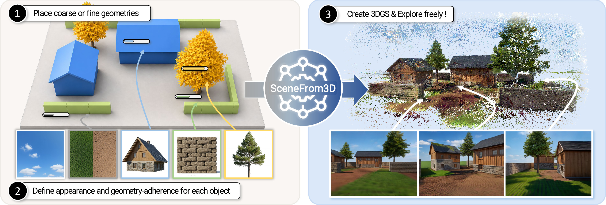

# SceneFrom3D

Official repository for **SceneFrom3D: Geometry-Conditioned Outdoor 3D Scene Generation via View Scheduling with Object-Level Control**.

<p align="center">
  <a href="https://kimgeonung.github.io/">Geonung Kim</a>,
  <a href="https://koyy001.github.io/">Jeongeun Park</a>,
  <a href="https://ryunuri.github.io/">Nuri Ryu</a>,
  <a href="https://lsn33096.github.io/index.html">Di Liu</a>,
  and <a href="https://www.scho.pe.kr/">Sunghyun Cho</a>
</p>

<p align="center">
  <a href="https://kimgeonung.github.io/SceneFrom3D/"><strong>Project Page</strong></a> |
  <a href="https://kimgeonung.github.io/assets/scenefrom3d/paper.pdf"><strong>Paper</strong></a>
</p>

<p align="center">
  
</p>

## Overview

SceneFrom3D is a geometry-conditioned framework for generating outdoor 3D scenes from user-provided object layouts. Given coarse or fine object geometries, together with per-object appearance and geometry-adherence controls, our method synthesizes a complete 3D Gaussian Splatting scene that can be rendered and explored from arbitrary viewpoints.

Existing generation pipelines are often limited to indoor or pre-defined camera settings, as constructing an effective view schedule becomes a major bottleneck for large, unstructured outdoor layouts. SceneFrom3D addresses this limitation with an automatic view-scheduling algorithm that selects anchor views, interpolation paths, and generation order directly from arbitrary outdoor geometry.

## News

- **Code release:** coming soon.

## Citation

If you find this project useful, please consider citing:

```bibtex
@article{kim2026scenefrom3d,
  title   = {SceneFrom3D: Geometry-Conditioned Outdoor 3D Scene Generation via View Scheduling with Object-Level Control},
  author  = {Kim, Geonung and Park, Jeongeun and Ryu, Nuri and Liu, Di and Cho, Sunghyun},
  journal = {arXiv preprint},
  year    = {2026}
}
```

## License

This repository is released under the [Apache-2.0 License](LICENSE).
